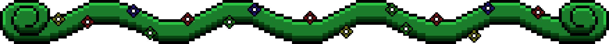
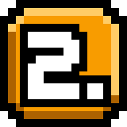
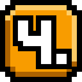

<!-- INTRO -->

	

 
 

> 🚧 ➥ Essa página está em construção, o que significa que o conteúdo atual pode mudar posteriormente.

 

<!-- SEPARATOR -->
 

	

  

<!-- END_SEPARATOR -->

<!-- CODE -->

	<h2>🛎️ ◈ Seja muitíssimo Bem-Vindo ◈ 🛎️</h2>

<h2>INTRODUÇÃO</h2>

	
Me chamo Davi Lucas (Mais conhecido pelo apelido Starciad) e sou um grande Aspirante da programação!

	
Sempre fui um entusiasta de assuntos que envolvessem computação e tecnologia, seja programação, TI, Softwares e qualquer outro assunto deste tipo. Até o momento levo a programação como apenas um hobby, porém trilho meu caminho aos poucos nesse grande mundo de tecnologia!

<!-- SEPARATOR -->
  

	

  

<!-- END_SEPARATOR -->

<h2>PERFIL</h2>

	
No meu perfil você irá encontrar todos os projetos que faço no tempo livro, seja projetos de teste, hobby, ou alguma tarefa de trabalho/escola. Todos eles possuem suas próprias peculiaridades e podem ser interessantes caso você queira ver como eu trabalho e programo!

 

	<h3>📕 ◈ ALGUNS DETALHES ◈ 📕</h3>

➥ Sinta-se livre para explorar os meus repositórios.

➥ Caso tenha interesse, você pode me ajudar colaborando com algum de meus repositórios!

> ⚠  》 Caso a ajuda esteja permitida no <b>Readme</b> principal do repositório.

➥ Quase todos os programas terão pequenas ideias e serão apenas por aprendizagem pessoal.

 

<!-- SEPARATOR -->
  

	

  

<!-- END_SEPARATOR -->

<h2>HISTÓRIA</h2>

	
Para mais informações sobre minha história de vida, clique no botão abaixo para ser redirecionado para a página HÍSTORIA.
 

 

	<a href="">
		<image width="30%" src="assets/images/buttons/history-button.webp" />
	</a>

<!-- SEPARATOR -->
  

	

  

<!-- END_SEPARATOR -->

<h2>CARREIRA</h2>

	
Para informações atualizadas e detalhadas sobre minha carreira na área de tecnologia com informações atuais, você pode clicar no botão abaixo para ser redirecionado para a página de carreira.

 

	<a href="">
		<image width="30%" src="assets/images/buttons/career-button.webp" />
	</a>

<!-- SEPARATOR -->
  

	

  

<!-- END_SEPARATOR -->

<h2>FORMAÇÕES</h2>

	
Caso você queira ver informações sobre minha formação e percurso na área acadêmica, pode clicar no botão abaixo para ser redirecionado a página de formação acadêmica.

 

	<a href="">
		<image width="30%" src="assets/images/buttons/technical-training-button.webp" />
	</a>

<!-- SEPARATOR -->
  

	

  

<!-- END_SEPARATOR -->

<h2>CONHECIMENTOS</h2>

	
Caso tenha interesse em saber e ter uma ideia das tecnologias que eu tenho conhecimento com descrições detalhadas sobre, clique no botão abaixo para ser redirecionado para a página de CONHECIMENTOS.

 

	<a href="">
		<image width="30%" src="assets/images/buttons/knowledge-button.webp" />
	</a>

<!-- SEPARATOR -->
  

	

  

<!-- END_SEPARATOR -->

<h2>PROJETOS</h2>

	
Gostaria de ver os projetos nos quais eu estive trabalhando? Clique no botão abaixo para ser redirecionado para a página de PROJETOS.

	<a href="">
		<image width="30%" src="assets/images/buttons/projects-button.webp" />
	</a>

<!-- SEPARATOR -->
  

	

  

<!-- END_SEPARATOR -->

<h2>CONQUISTAS</h2>

	
Gostaria de ver minhas conquistas e façanhas pessoais de um jeito mais animado e divertido? Clique no botão abaixo para ser redirecionado para a página de CONQUISTAS

 

	<a href="">
		<image width="30%" src="assets/images/buttons/achievements-button.webp" />
	</a>

<!-- SEPARATOR -->
  

	

  

<!-- END_SEPARATOR -->

<h3 align="center">🌞 E é isso! Obrigado por ler até aqui! 🌞</h3>
