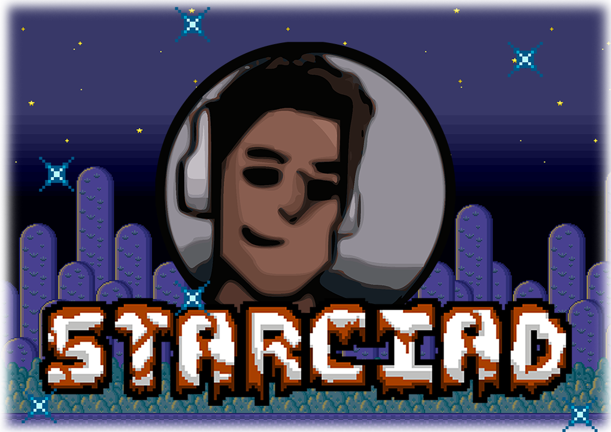
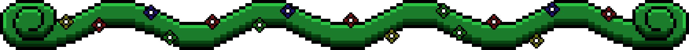
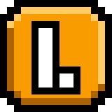
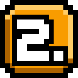
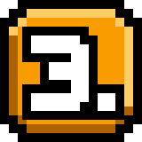
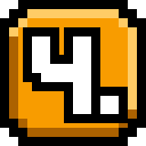
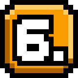
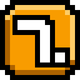
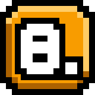

<!-- INTRO -->

	

 
 

> 🚧 ➥ Essa página está em construção, o que significa que o conteúdo atual pode mudar posteriormente.

 

<!-- SEPARATOR -->
 

	

  

<!-- END_SEPARATOR -->

<!-- CODE -->

	<h2>🛎️ ◈ Seja muitíssimo Bem-Vindo ◈ 🛎️</h2>

 

<h2>INTRODUÇÃO</h2>

	
Meu nome é Davi Fernandes (mais conhecido pelo apelido "Starciad"). Sou um apaixonado pela programação e pelos assuntos relacionados à tecnologia, como TI e softwares. Atualmente, trato a programação como um hobby, mas estou trilhando meu caminho nesse vasto mundo da tecnologia. Se você quiser saber mais sobre mim, confira as próximas seções listadas abaixo. Elas contêm informações detalhadas sobre mim e são divididas em títulos curtos e descritivos.

<!-- SEPARATOR -->
  

	

  

<!-- END_SEPARATOR -->

<h2>PERFIL</h2>

	
No meu perfil, você pode encontrar todos os projetos que eu faço em meu tempo livre. Isso inclui meus projetos de teste, hobbies e algumas tarefas escolares e de trabalho. Cada um deles tem suas próprias características únicas e, em cada repositório, você encontrará informações detalhadas sobre a finalidade e função de cada projeto. Eles também podem ser úteis para dar uma ideia de como eu penso, trabalho e organizo meus projetos. Sinta-se à vontade para explorá-los ao máximo!

 

	<h3>📕 ◈ DETALHES EXTRAS ◈ 📕</h3>

	
➥ Sinta-se livre para explorar e brincar com meus repositórios.

	
➥ Caso tenha interesse e esteja listado no <b>README</b> principal do repositório, você pode ajudar colaborando com conteúdos extras para o projeto!

	
➥ Lembre-se, a maioria dos projetos encontrados neste perfil são experimentações de ideias e aprendizados, caso tenha interesse, sinta-se livre para estuda-los e fazer recomendações!

 

<!-- SEPARATOR -->
  

	

  

<!-- END_SEPARATOR -->

<h2>HISTÓRIA</h2>

	
Possui interesse em ler um breve resumo do meu percurso na programação? Para mais informações sobre minha história de vida, clique no botão abaixo para ser redirecionado para a página <b>HÍSTORIA</b>.
 

 

	<a href="content/history.md">
		<image width="30%" src="content/assets/images/buttons/pages/history-button.webp" />
	</a>

<!-- SEPARATOR -->
  

	

  

<!-- END_SEPARATOR -->

<h2>CARREIRA</h2>

	
Gostaria de ler informações detalhadas e atualizadas sobre minha carreira profissional na área de tecnologia? Clique no botão abaixo para ser redirecionado para a página de <b>CARREIRA</b> e obter mais informações.

 

	<a href="content/career.md">
		<image width="30%" src="content/assets/images/buttons/pages/career-button.webp" />
	</a>

<!-- SEPARATOR -->
  

	

  

<!-- END_SEPARATOR -->

<h2>FORMAÇÕES</h2>

	
Gostaria de ver informações sobre minhas formações acadêmicas? Clique no botão abaixo para ser redirecionado para a página de <b>FORMAÇÕES ACADÊMICAS</b>.

 

	<a href="content/technical-training.md">
		<image width="30%" src="content/assets/images/buttons/pages/technical-training-button.webp" />
	</a>

<!-- SEPARATOR -->
  

	

  

<!-- END_SEPARATOR -->

<h2>CONHECIMENTOS</h2>

	
Gostaria de ver informações atualizadas sobre todas as tecnologias de que tenho conhecimento? Clique no botão abaixo para ser redirecionado para a página de <b>CONHECIMENTOS</b>.

 

	<a href="content/knowledge.md">
		<image width="30%" src="content/assets/images/buttons/pages/knowledge-button.webp" />
	</a>

<!-- SEPARATOR -->
  

	

  

<!-- END_SEPARATOR -->

<h2>PROJETOS</h2>

	
Gostaria de ver informações detalhadas de todos os projetos em que trabalhei? Clique no botão abaixo para ser redirecionado para a página de <b>PROJETOS</b>.

	<a href="content/projects.md">
		<image width="30%" src="content/assets/images/buttons/pages/projects-button.webp" />
	</a>

<!-- SEPARATOR -->
  

	

  

<!-- END_SEPARATOR -->

<h2>CONQUISTAS</h2>

	
Gostaria de ver de forma divertida e interessante todas as minhas realizações e conquistas pessoais? Clique no botão abaixo para ser redirecionado para a página de <b>CONQUISTAS</b>.

 

	<a href="content/achievements.md">
		<image width="30%" src="content/assets/images/buttons/pages/achievements-button.webp" />
	</a>

<!-- SEPARATOR -->
  

	

  

<!-- END_SEPARATOR -->

<h2>REDES SOCIAIS</h2>

	
Veja também minhas outras <b>Redes Sociais</b>!

 

	<a target="_blank" href="https://twitter.com/starciad">
		<image width="30%" src="content/assets/images/buttons/social-medias/twitter-button.webp" />
	</a>
	<a target="_blank" href="https://www.reddit.com/user/Starciad">
		<image width="30%" src="content/assets/images/buttons/social-medias/reddit-button.webp" />
	</a>
	<a target="_blank" href="https://www.youtube.com/@starciad">
		<image width="30%" src="content/assets/images/buttons/social-medias/youtube-button.webp" />
	</a>
	<a target="_blank" href="https://starciad.itch.io">
		<image width="30%" src="content/assets/images/buttons/social-medias/itch-button.webp" />
	</a>
	<a target="_blank" href="https://gamejolt.com/@Starciad">
		<image width="30%" src="content/assets/images/buttons/social-medias/game-jolt-button.webp" />
	</a>
	<a target="_blank" href="https://discord.gg/pdjuAPHGTh">
		<image width="30%" src="content/assets/images/buttons/social-medias/discord-button.webp" />
	</a>

<!-- SEPARATOR -->
  

	

  

<!-- END_SEPARATOR -->

<h2 align="center">🌞 E é isso! Obrigado por ler até aqui! 🌞</h2>

 Como seres humanos, continuamos a escrever nossa grande história, cada um de nós trilhando seu próprio caminho e amadurecendo através de uma infinidade de experiências novas. É por meio destas experiências que construímos nossa própria biblioteca de conhecimento e sabedoria, tornando-nos o que somos hoje.

