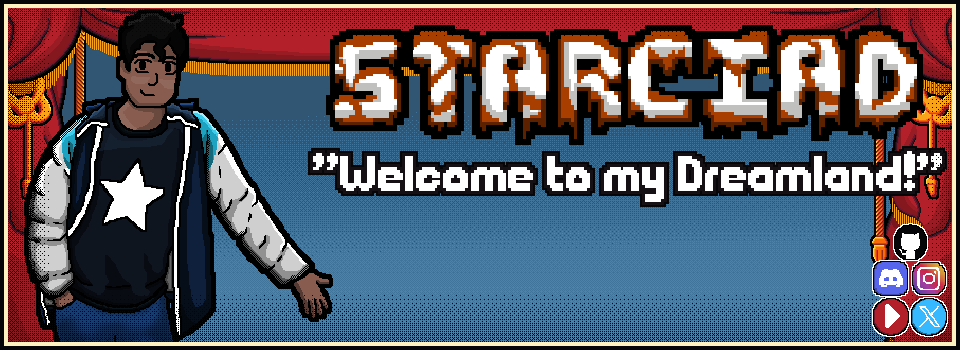

# Starciad

[🌍 • Website Oficial](https://starciad.github.io/)

## ✨ ➥ Bem-vindo(a) a minha terra dos sonhos

Sou Davi Fernandes, conhecido pelo apelido “Starciad”. Aqui você vai descobrir minha jornada como entusiasta de tecnologia e programação, guiada pela curiosidade e pelo desejo constante de aprender.

## 🚀 ➥ O que faço

No meu tempo livre, gosto de desenvolver aplicações e protótipos que me desafiam a explorar novos conceitos e padrões. Seja implementando uma mecânica de jogo em MonoGame ou criando pequenos utilitários em C#, meu objetivo é consolidar aprendizados e compartilhar cada etapa do desenvolvimento.

Você encontrará detalhes sobre propósito e funcionalidades diretamente em cada repositório, mostrando como raciocino, estruturo e aperfeiçoo minhas criações.

## 💻 ➥ Estatísticas e principais linguagens

## 🙏 ➥ Agradecimentos

Obrigado pela visita e pelo interesse no meu trabalho. Espero que você se inspire e volte para acompanhar os próximos projetos. Bons cliques e até breve!
